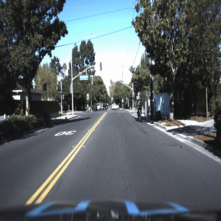

## 车辆检测、车道检测

### 项目说明

***NKU计算机视觉基础大作业，参考了一些博客和github源码，实现了简单实时的车辆检测和车道检测，没有采用深度学习，有一定误检率，车道检测对于光线环境要求很高，在有些数据集上表现很好，在其他数据集上表现很差***


### 博客链接与数据集链接

[道路检测参考一](https://zhuanlan.zhihu.com/p/31623107)

[道路检测参考二](https://zhuanlan.zhihu.com/p/29113411)

[道路检测参考三](https://zhuanlan.zhihu.com/p/35134563)

[车辆检测参考一](https://zhuanlan.zhihu.com/p/35607432)

[车辆检测参考二](https://blog.csdn.net/lhbbzh/article/details/42345931)

[车辆检测参考三](https://towardsdatascience.com/vehicles-tracking-with-hog-and-linear-svm-c9f27eaf521a)

[数据集一正样本](http://download.csdn.net/detail/zhuangxiaobin/7326197)

[数据集一负样本](http://download.csdn.net/detail/zhuangxiaobin/7326205)

[数据集二](https://link.zhihu.com/?target=https%3A//pan.baidu.com/s/13nCrYRdeK7TydsUiDiuHNA)

[数据集三](https://github.com/udacity/self-driving-car/tree/master/annotations)

***注：数据集一来自ＣSDN论坛里博主自制的数据集，数据集二与数据集三均来自udacity的self driving car 项目的官方数据集。除此之外还有许多数据集可用于训练测试，除了以上三个数据集，kitti数据集也是非常棒的数据集，链接为：[KITTI](http://www.cvlibs.net/datasets/kitti/)***


### 环境配置

**opencv3.0+**

**opencv-contrib**

**cmake**

**CLion编译器(可选)**

**opencv python版本**

项目主要由opencv编写，并且用到了contrib额外库，如何配置请参考网上博客教程。实验平台为ubuntu16.04。同时为了方便我用python对一些数据集进行处理，因此还需用到python 2.7。


### 运行

- 方式一：采用CLion编译器导入项目文件，运行```main.cpp```即可

- 方式二：如果觉得安装CLion编译器麻烦，则可以手动相应的cmake命令

  ```cmake
  $CMAKE/cmake -DCMAKE_BUILD_TYPE=Release -G "CodeBlocks - Unix Makefiles" $PROJECT
  ```

  接着运行

  ```cmake
  $CMAKE/cmake --build $PROJECT/cmake-build-release --target cv -- -j 2
  ```

  其中```$CMAKE```指cmake.exe所在的路径，```$PROJECT```指当前项目的路径

如果为了节省时间，建议直接导入CLion中运行，如果运行不成功或失败，请确保c++文件和python文件中一些数据集，模型等变量读取路径的正确性。


### 原理

对于车辆检测，主要采用如下的pipline:

1. 首先提取HOG特征，用SVM进行训练得到hog-svm分类器
2. 提取haar特征，利用cascade进行训练得到haar-cascade分类器
3. 利用两个分类器对图片中的汽车进行检测，在进行nms非极大值抑制

对于车道检测，主要采用如下的pipline:

1. 对图像进行透视变换，使其变为鸟瞰图
2. 对原图像进行x-sobel滤波，并进行阈值过滤
3. 对原图像转换到HLS空间，保留黄色和白色(车道多为黄色和白色)
4. 根据2,3步得到最终的二值图
5. 利用霍夫变换找出相应的直线端点
6. 对这些点进行线性回归
7. 画图直线，显示到原图上


### 实例

**数据集二上的测试片段**


**数据集三的测试片段**




### 如何训练

在项目中我已经提供了训练好的HOG分类器和haar分类器，这两个xml文件分别在model文件夹下和model/adaboost文件夹下。

训练**HOG分类器**

- 下载数据集一和数据集二，修改**python_func/BuildImgList.py**中的变量```path_vechile```、```path_non_vechile```、```path_non_vechile2```为你的数据集实际路径，然后运行该python文件，会在当前目录下生成**train.txt**和**test.txt**，把这两个txt文件剪切到img文件夹中。
- 在```main.cpp```中运行函数**HOGSVMtrainAuto()**和**HOGSVMtest**此时会在文件夹model下生成一个**svm_hog_classifier.xml**文件，这就是训练好的模型

***注：如果想要提高模型精度，可以寻找hard example进行再训练，这里由于数据集二中提供的视频缺少groung truth box的标注信息，因此我在数据集三上进行的再训练，同时，可能代码中有些bug，在再训练的时候迭代了几次之后内存爆炸，hog模型在自己的机器上只有前四次生成了xml文件，后面步骤卡死了***

- *(可选)再训练：*

  - 下载数据集三，修改**python_func/Validatebbox2.py**中的变量```data_path```(所下载数据集的路径)和```annotation```(你想存放的xml路径)，然后运行该python文件。
  - 之后运行**python_func/BuildRetrainImgList.py**和**python_func/GetHardEx.py**会生成**Retrain.txt和retrain_pos.txt**讲这两个txt文件移动到img文件夹中
  - 在```main.cpp```中运行函数**FindHardExampleAndRetrain()**

  

训练**Haar分类器**

参考opencv官网教程以及车辆检测参考二链接


### 如何测试

在```main.cpp```中运行函数**FinalDetect()**,其结构如下：

```c++
void FinalDetect(string filename, 		//视频文件目录
				string model_cascade, 	//haar分类器
				string model_hog,		//hog分类器
				int dataset, 			//选择哪个数据集
				bool IsLine);			//是否进行直线检测
```

这里如果```dataset=1```表示测试第二个数据集，```dataset=2```表示测试第三个数据集

***注：数据集三为图片形式，可以调用或者修改python_func/MadeVedio.py制作视频***

除此之外如果想进行单独测试,在```detection.cpp```中还有其他函数：

```c++
void adaboostTest(string model_path, string img_name);
void HOGdetect(string filename);
void MultiScaleDetect(string model_hog, string model_cascade, string filename);
void LineDetect(string imgname);
```

- ```adaboostTest```:haar分类器单独测试
- ```HOGdetect```:hog分类器单独测试
- ```MultiScaleDetect```:结合haar分类器和hog分类器
- ```LineDetect```:测试道路线

在```main.cpp```中运行任意一个即可。

***注：由于数据集三是以图片形式存在而非视频，因此除了LineDetect()，以上的其他三个函数都是图片读入而非视频流读入，你可以对这几个函数的细节改动下使其变为视频读入。***


